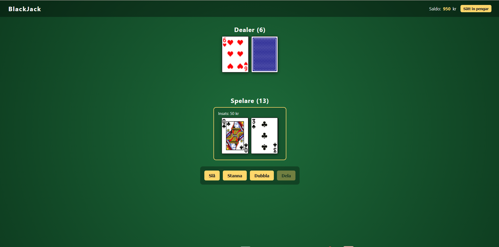
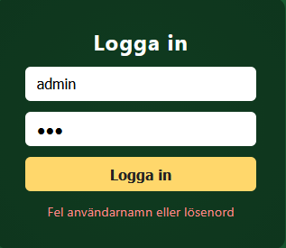
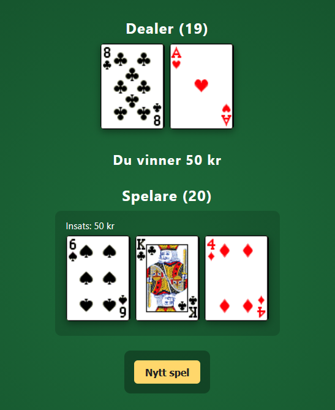
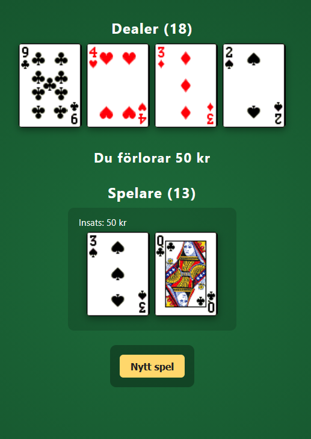

# Black Jack

An exercise for a simple web-based Blackjack game where you play against a computer dealer. Built with plain HTML, CSS, and JavaScript. Part of my education as .NET-Developer at IT-Högskolan



## How to run

The project uses ES modules (`import` / `export`), which browsers refuse to load over `file://`. You must serve it from a local web server.

1. Open the project folder in **Visual Studio Code**.
2. Install the **Live Server** extension if you don't already have it.
3. Right-click `index.html` and choose **Open with Live Server**.
4. The game opens in your default browser, usually at `http://127.0.0.1:5500/`.

Opening `index.html` directly by double-clicking will not work — the page will load but the JavaScript will fail to import.

## Login

The game starts on a login screen.

| Field        | Value   |
| ------------ | ------- |
| Användarnamn | `admin` |
| Lösenord     | `admin` |

Type those in and click **Logga in** (or press Enter). Wrong credentials show the message _"Fel användarnamn eller lösenord"_ below the button.



## How to play

After logging in you start with **1000 kr** on the account.

### 1. Place a bet

Type an amount in the **Insats** field (default 50 kr, step 10 kr). The **Spela** button enables when the bet is valid must be more than 0 kr and not more than your current balance.

### 2. Deal

Click **Spela**. The dealer and player each receive two cards. The dealer's second card stays face-down (`Hidden-Card.png`) and only the visible card counts toward the displayed dealer score.

If either side gets a natural Blackjack on the deal (Ace + 10/J/Q/K), the round ends immediately. And for the player you get a 3:2 payout.

### 3. Take actions

Four action buttons are shown:

- **Slå** — draw one more card (Hit).
- **Stanna** — end your turn, dealer plays (Stand).
- **Dubbla** — double the bet, draw exactly one card, auto-stand. Only available on the first two cards of a hand and only if you have enough balance.
- **Dela** — split the hand into two. Only enabled when your first two cards have the **same rank** (e.g. 8 and 8, K and K — but not 10 and J). Each split hand gets its own bet equal to the original. You play them one at a time, left to right, with the active hand highlighted by a yellow border.

A hand that goes over 21 busts. A hand that reaches exactly 21 auto-stands for simplicity.

### 4. Dealer plays

When all your hands are finished, the dealer flips the hidden card face-up and keeps drawing cards until reaching **17 or higher**. If every one of your hands busted, the dealer doesn't bother drawing because they already won.

### 5. Result and payout

| Outcome                                     | Return on bet               |
| ------------------------------------------- | --------------------------- |
| Blackjack (natural 21 with exactly 2 cards) | Bet back plus 1.5x winnings |
| Win (your final score beats the dealer's)   | Bet back plus 1x winnings   |
| Push (tie)                                  | Bet back, no winnings       |
| Loss (you bust or dealer beats you)         | Bet is gone                 |

The result line appears (for example _"Du vinner 50 kr"_ or _"Du förlorar 50 kr"_). If you split, each hand's outcome is shown separately, joined by `|`.





### 6. Play again

Click **Nytt spel** to clear the table and place a new bet. Your balance persists between rounds.

## How to insert money

If your balance runs low, click **Sätt in pengar** in the top-right corner of the page. Each click adds **500 kr** to your account. There's no limit on how many times you can do this.

## File structure

```
Labb_1_BlackJack/
├── pictures/        playing card images (A-S.png, 10-H.png, Hidden-Card.png, ...)
├── index.html       page structure
├── styles.css       all visual styling
├── README.md        this file
└── js/
    ├── deck.js      card data + deck creation, shuffle, draw
    ├── score.js     hand scoring with Ace being able to be both 1 and 11
    ├── game.js      game state and rules
    └── main.js      DOM rendering and event listeners
```

`index.html` only includes one script tag — `<script type="module" src="js/main.js">` — and the other JS files logic are loaded automatically through `import` statements.

## Implementation notes

- Plain HTML / CSS / JavaScript
- Single 52-card deck, reshuffled every round with the **Fisher–Yates** algorithm.
- Aces count as 11 or 1 depending on which keeps the hand under 22 (soft Ace handling).
- Dealer stands on all 17s (and above).
- Blackjack pays 3:2. Both having natural Blackjack is a tie.
- Split allowed only on equal rank, no re-splits, no double-after-split limitations. Split Aces get one card each and auto-stand.

## Credentials disclaimer

The login is a hardcoded `admin` / `admin` in JavaScript just to be able to practice styling for a login page.
This is intentional because it is supposed to be a simple exercise for school, but would never be used in a real application with security in mind.
